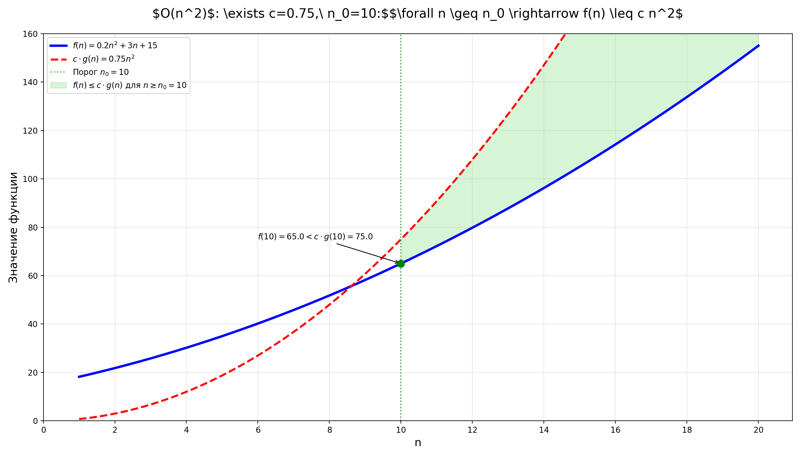
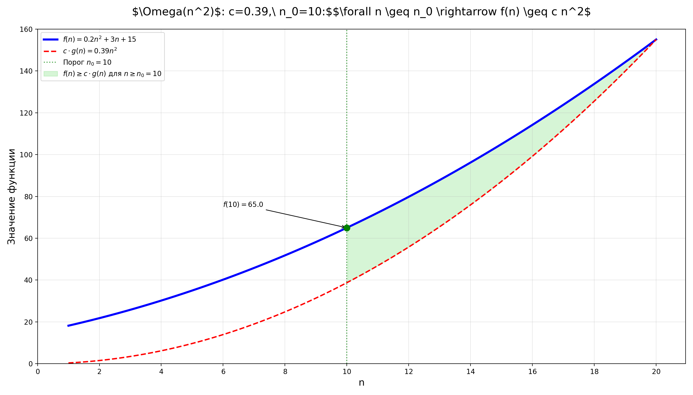
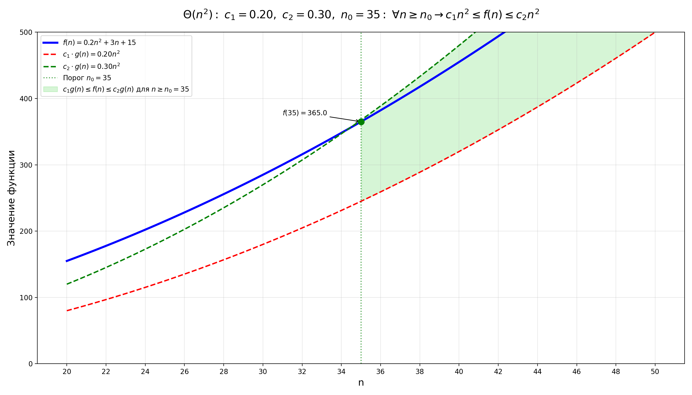

# Asymptotic Analysis Visualizer

[](https://pre-commit.com/)
[](https://docs.astral.sh/ruff/)

---

## 📈 О проекте

Визуализация асимптотических оценок функций (O, Ω, Θ) на Python. Все графики автоматически сохраняются в папку [`plots/`](plots/).

---

## 🧠 Сложность алгоритмов: ключевые концепции

**Асимптотический анализ алгоритмов** — изучает зависимость ресурсов (время/память) алгоритма от размера входных данных $n$ при $n \to \infty$. 

Это **общая концепция**, включающая $O$, $\Omega$, $\Theta$.

**Два ключевых вида сложности:**
1. **Временная (Time Complexity)** — время выполнения алгоритма. Пример: $O(n^2)$ для сортировки пузырьком
2. **Пространственная (Space Complexity)** — объем используемой памяти. Пример: $O(1)$ для in-place сортировки

### Асимптотические обозначения: O, Ω, Θ

#### O-большое (верхняя граница)
- $f(n) \leq c \cdot g(n)$ при больших $n$
- "Не хуже" (максимальная скорость роста)
- $O(n): \exists\ c > 0,\ n_0 > 0:\ \forall\ n \geq n_0 \Rightarrow f(n) \leq c \cdot g(n)$



#### Ω-большое (нижняя граница)
- $f(n) \geq c \cdot g(n)$ при больших $n$
- "Не лучше" (минимальная скорость роста)
- $\Omega(n): \exists\ c > 0,\ n_0 > 0:\ \forall\ n \geq n_0 \Rightarrow f(n) \geq c \cdot g(n)$



#### Θ-большое (точная граница)
- $c_1 \cdot g(n) \leq f(n) \leq c_2 \cdot g(n)$
- "Ровно так" (совпадение границ)
- $\Theta(n): \exists\ c_1 > 0,\ c_2 > 0,\ n_0 > 0:\ \forall\ n \geq n_0 \Rightarrow c_1 \cdot g(n) \leq f(n) \leq c_2 \cdot g(n)$



**Правила при оценке:**
- **Константы игнорируются:** $O(5n) \equiv O(n)$
- **Доминирующий член:** $O(n^2 + n) \rightarrow O(n^2)$
- **Учитываются все входные параметры:** $O(5n + 3m) \equiv O(n+m)$

---

## 🚀 Быстрый старт

1. **Клонируйте репозиторий и перейдите в папку проекта:**
   ```bash
   git clone 
   cd asymptotic_analysis
   ```
2. **Установите зависимости через [uv](https://github.com/astral-sh/uv):**
   ```bash
   uv sync
   ```
3. **(Рекомендуется) Установите pre-commit хуки:**
   ```bash
   uv tool run pre-commit install
   ```
4. **Запустите любой из скриптов:**
   ```bash
   uv python big_o_example.py
   uv python big_omega_example.py
   uv python big_theta_example.py
   ```
5. **Графики появятся в папке [`plots/`](plots/).**

---

## 🧹 Качество кода

- Используется [Ruff](https://docs.astral.sh/ruff/) для автоформатирования и линтинга.
- Все проверки и автоисправления запускаются автоматически при коммите через pre-commit.
- Для ручного запуска:
  ```bash
  uv tool run pre-commit run --all-files
  ```

---

## 📂 Структура проекта

```
.
├── big_o_example.py
├── big_omega_example.py
├── big_theta_example.py
├── plots/
│   ├── big_o_notation.png
│   ├── big_omega_notation.png
│   └── big_theta_notation.png
├── pyproject.toml
├── pre_commit.md
├── README.md
└── ...
```

---

## 📝 Полезные команды

- **Форматирование и автоисправление кода:**
  ```bash
  uv tool run pre-commit run ruff --all-files
  uv tool run pre-commit run ruff-format --all-files
  ```
- **Обновление хуков:**
  ```bash
  uv tool run pre-commit autoupdate
  ```

---

## 📚 Лицензия

MIT

---

> Проект создан для наглядного изучения асимптотических оценок и современных практик Python-разработки.
